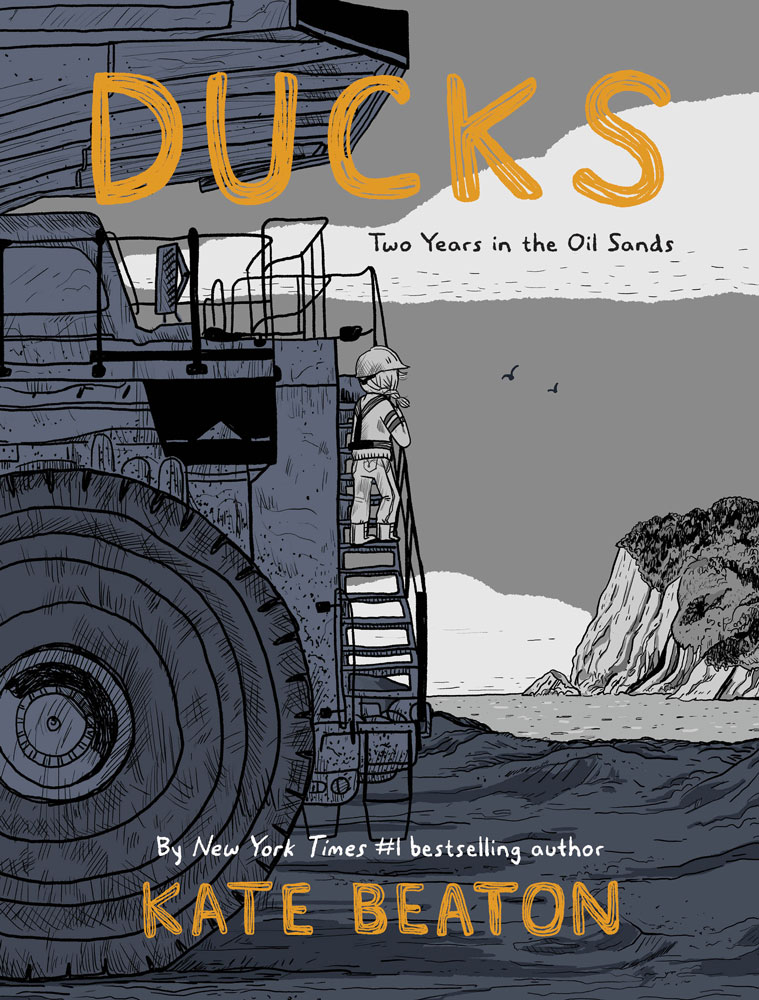

Finding good books is easy, finding worthwile books to read is much harder.

To help fellow readers in their book selection journey, here is the list of all the books I read this year.
Pretty much all of them are worth reading in their own rights. 
The goal is thus not to review them, but rather to indicate why they matter and who could be interested in reading them. 

With that in mind, and in no particular order, here is the full list:

## Non-fiction

#### The Future is Degrowth by Matthias Schmelzer, Aaron Vansintjan and Andrea Vetter

<figure >

</figure>

A holistic discussion of the concept of degrowh, touching not only on the obvious elements of minimizing our natural cpaital footprint, but also exploring the impact of degrowth on democracy, inequalities, and other political and social aspects. While striving to be accessible, the academic tone of the authors might turn away a few readers and misses an opportunity for a clearer call to action.

For those looking for a shorter introduction to the topic, this [excellent interview](https://open.spotify.com/episode/51nudbQzbNJMggpw0DDBlT) of Timothee Parrique offers a clear and compelling argumentation (if less holistic).

---

#### How to Blow Up a Pipeline by Andreas Malm

<figure >

</figure>

Probably the most controversial book on this list. 
Building on historical analogies such as the obtention of women voting rights, Andreas Malm makes the convincing case that all major societal changes involved some form of violence (targeted at *material assets*, not people). 
In view of the lack of progress to curb GHG emissions and reducing our impact on the other planetary boundaries, Malm's view will likely strike a chord in many readers (incidently, fiction works exploring these questions such as the excellent *Ministry of the Future* also involve factions using physical destruction as a trigger for change).

---

#### Prisoners of Geography by Tim Marshall

<figure >

</figure>

Tim Marshall sheds light on many past and current geopolitical events by looking at how the geographic features of a region determine (or at least largely constraint) the options available to its nations and inhabitants. 
A very illuminating read that, by its nature, will remain relevant for a long time. 

---

####  Empires of Eve by Andrew Groen

<figure >

</figure>

Eve is one of the oldest MMORPG and a sci-fi strategy sandbox for players to explore, socialize, colonize and conquer. 
In Empires of Eve, Andrew Groen reconstructs the history of this virtual world, its geopolitics, warfare and culture. 
He offers a fascinating view of what essentially became a massive social experiment - told through the real stories of the rise and fall of individuals and galactic alliances. 

---

#### Governing the Commons by Elinor Ostrom

<figure >

</figure>

In this brilliant piece of academic writing, Ostrom introduces her contributions to the field in a clear, rigorous, and compelling way. She demonstrates that the so-called tragedy of the commons is not a fatality and that, contrary to popular beliefs, communities have successfully [managed complex commons](/posts/prosperityofcommons) for hundreds of years.
A fantastic read for anyone looking to expand their perspective beyond the mainstream capitalist narrative. 

---

#### How to Take Smart Notes by Sönke Ahrens

<figure >

</figure>

I've been looking at improving my note taking for a while, and by that I mean not just as a 'basic' tool for creating minutes of boring meetings, but as an organizing and even creative tool. 
I had started reading about the Zettlekasten method and its variants, but coudn't properly figure out how to make it work.
This book really helped me see the potential of building a proper note system, and I have now adapted some of its strategies to improve my productivity and creativity (for those looking to experiment with building a note system, I recommend the [Logseq](https://logseq.com/) software).
  
---

#### The Utopia of Rules by David Graeber

<figure >

</figure>

David Graeber is one of my favorite thinker of all time. 
His ideas are always brilliant and his writing irreverent, which makes a powerful combination. 
In *The Utopia of Rules*, Graeber offers a fascinating take on the role of bureaucracy, and how it's used to not only to kill creativity but to support structurally stupid systems.
Read it for the provocative insights, and stay for the exploration of fantasy or super-hero stories as both opposing and validating bureaucratic regimes.

---

#### War Against All Puerto Ricans: Revolution and Terror in America's Colony by Nelson A Denis

<figure >

</figure>

Most of us associate the horror of colonialism with the usual suspects: England, the Netherlands, Spain, Belgium and the likes. 
Lesser know is that America has acted in the same way as the other Western powers, except not only in places like the Philippines, but in its *own territory*.

This book recounts all the plundering, worker exploitation and other atrocities that Puerto Rico suffered over the years. 
Political prisoners, torture, assasinations: the US government smashed any attempt at revolt or independance with an iron fist. 
And if you doubt the scale of what we're talking about here, know that between the 1930s and the 1970s about *one-third of the female population in Puerto Rico underwent forced sterilization*.

I guess Uncle Sam is not always benevolent after all. 

---

#### The True Believer by Eric Hoffer

<figure >

</figure>

One of those rare books where insights jump at you at every pages. 
What do nationalism, religions, socialism have in common? 
Anyone interested in mass movements and human nature will benefit from Hoffer's work.
Especially relevant in current times.

---

#### Thanks for the Feedback by Douglas Stone and Sheila Heen

<figure >

</figure>

A suggested reading as part of my [altMBA](https://altmba.com/), I found this book a very heplful way for individuals to learn how to properly give - and receive - feedback, and for managers to help foster a feedback culture.

---

#### The Art of Possibility by Rosamund Zander and Benjamin Zander

<figure >

</figure>

Conductor Benjamin Zander and pshychotherapist Rosamund Zander offer valuable lessons and memorable stories on viewing the world through the lens of creating new opportunities. Somewhat less actionable than other books on the topic, it still provides a stimulating read for anyone interested in expending her horizon. 
Also suggested reading as part of my [altMBA](https://altmba.com/).

---

#### The Empty Mirror: Experiences in a Japanese Zen Monastery Paperback by Janwillem van de Wetering

<figure >

</figure>

In this biography, van de Wetering recounts his experience as a young Dutch student going to Japan to apprentice in a Zen monastery.
True to its theme, the author doesn't try to convey any lessons or insights but instead leaves any interpretation and meaning to be found to the reader. 

---

#### The War of Art by Steven Pressfield

<figure >

</figure>

A gripping manifesto on the drive and crucible of making art. 
Anyone interested in creating or delivering not only art but any meaningful project would benefit from reading this short book - chances are you will start your work differently the next day.
Yet another suggested reading as part of my [altMBA](https://altmba.com/) 

---

#### Pure Invention: How Japan's Pop Culture Conquered the World by Mat Alt

<figure >

</figure>

Both highly informative and entertaining, *Pure Invention* follows successive generations as Japan re-invented itself in the post-WWII era. At each stage, Japan society created unique artifacts that ended up shaping our Western culture. Maybe more importantly, the book shows how these inventions arose from Japan's unique societal and cultural context.

---

## Science

#### Love and Math by Edward Frenkel

<figure >

</figure>

Edward Frenkel is one of the leading figure in mathematical physics. 
Part auto-biography and part scientific vulgarization, this books introduced me both to the Langlands program and to life as Jew looking to become a professional mathematician in the Soviet Union. 
Both stories are well worth knowing, and you can also hear some of Frenkel personal and profesional stories in his [interview with lex Fridman](https://lexfridman.com/edward-frenkel/). 

---

#### A Thousand Brains: A New Theory of Intelligence by Jeff Hawkins

<figure >

</figure>

In *A Thousand Brains*, Jeff Hawkins shares his theory on how our brain works. 
His unconventional approach is thought-provoking, and it is both encouraging to see that Hawkins is able to pursue it and distressing that he has to do through a private company.
In any case, I do believe that any significant progress on understanding - and potentially simulating - the brain will come from a non-conventional approach, and Hwakins' proposal certainly looks very promising.

A must read in for anyone interested in the brain, with later parts of the book offering some of the author's perspective on AI (arguably less ground-breaking than the first part of the book, but still worth the read).

---

#### Seeing Science by Jack Challoner

<figure >

</figure>

In *Seeing Science*, Chandler beautifully illustrates both core and practical scientific concepts, from stars composition to climate change. 
A book that re-creates the sense of wonder one gets when doing science, and whose stunning visuals will appeal to both children and adults.

---

## Fiction

#### The Fountainhead by Ayn Rand

<figure >

</figure>

I discovered *The Fountainhead* this year even tough it's extremely influential, especially in the US.
*The Fountainhead* together with *Atlas Shrugged*, Rand's other major fiction, are said to crystallize her philosophy of objectivism and *laissez-faire capitalism*. 

Ayn Rand is a talented author, and I can see why the book has had such a long-lasting influence, especially on libertarians and many of the Silicon Valley apologists. 

---

#### The Dragon Never Sleeps by Glen Cook

<figure >

</figure>

One of my favorite space-opera story. 
I won't say more than this is the second time I read it, and I still think this is a [hidden masterpiece](/posts/thedragonneversleeps).

---

#### Shards of Honor by Lois Bujold

<figure >

</figure>

Another book I read for a second time. 
Definitely a great place to start this classic Sci-Fi series.

---

#### The Mountain in the Sea by Ray Nayler

<figure >

</figure>

Octopuses are one of the most fascinating and intelligent animals. 
Any book exploring them will find a soft place in my heart. 
While the book fall short on delivering some of its promises and with some stylistic issues, it remains a fun read and a great debut novel. 

---

#### Eisenhorn by Dan Abnett

<figure >

</figure>

Set in the *Warhammer 40,000* universe, this trilogy follows inquisitor Eisenhorn in his crusade againt heretics and demons.
While I only read the first book of the trilogy, I see the potential of the series and it definietly made the vast and grim Warhammer universe come to life. 

---

## Comics

#### The Nib

<figure >

</figure>

A series of [political comics](https://thenib.com/) that offer a variety of perspectives and are always well-researched and documented. 

Each volume has a theme, ranging from Cities to Death or Empires. 
I learnt something new, and was shocked or deeply moved, in every single volume.

---

#### Ducks: Two Years in the Oil Sands by Kate Beaton

<figure >

</figure>

In this biography, Kate Beaton tells the story of her years working in the Alberta Oil Sands to pay off her student debts.
An honest and gripping recollection of her experience, which touches on many issues of this extractive (both literally and figuratively) industry.

---

#### A Fire Story by Brian Fies

<figure >

</figure>

A first-hand account of the author's and other families losing their homes to fires in California. 
A sad reminder that our societies are not ready for these type of extreme events, which are likely to increase in frequency in the coming years.
Improving our individual and collective resilience could go a long way as we brace ourselves for more natural disasters. 
