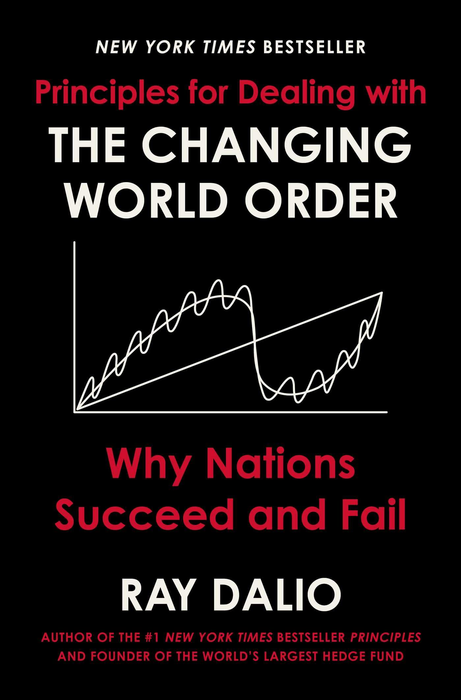
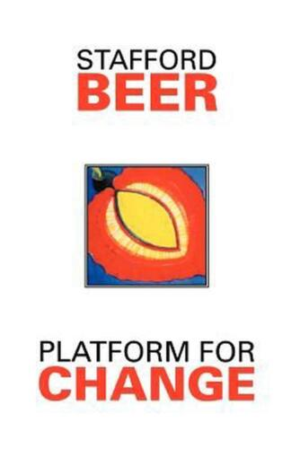
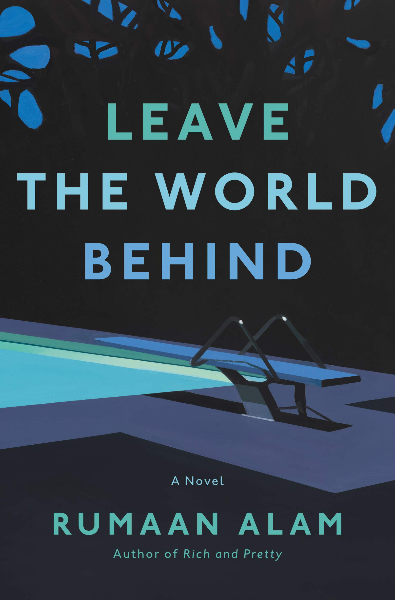

I started compiling the books I read last year, and it's been very rewarding. 
I can easily share the list with friends and colleagues. 
I can look back to find a particular title. 
And writing a small blurb on each book forces me to revisit it and think about what it meant for me (although I only share a teaser here, any deeper discussion would be done in a dedicated post). 

However, a yearly update feels too restrictive, so I've decided to share intermediate updates. 
This is the April one, I'll probably share the next one after the summer.
You can also check the previous year: [2023](/posts/2023books) 

Now, I read many different types of books, often in parallel. 
Which book I read at a given time mostly depend on my mood: Do I want something serious, dramatic, inspiring?
This is something that is hard to judge in advance, which is why I was delighted to find out that [StoryGraph](https://www.thestorygraph.com/) offers just that: A way to discover books [based on your mood](https://www.polygon.com/24026840/storygraph-goodreads-alternative-reading-book-tracking-app). 
I haven't tried it yet, but this definitely resonates more with me than the traditional apps such as Amazon's GoodReads (plus, any alternative to Amazon's monopoly is a win!).

## Non-fiction

#### How Infrastructure Works By Deb Chachra

<figure >

</figure>

This book draws attention to what is mostly invisible to us: the role of infrastructure, not only in providing essential commodities but in shaping our societies.
Chachra's vision is partly based on the important observation that materials - not energy - is the limiting factor on Earth, even tough we are still behaving as if energy was the most important input.

Even tough the book is intended for a general audience, I believe it would have benefitted from some hard facts and numbers to ground some of the discussion. 
Regardless, this is an important book that paints an optimistic view of what can be achieved as we tackle some of our most important societal and environement challenges.

---

#### Principles for Dealing with the Changing World Order By Dalio Ray

<figure >

</figure>

Many feel increasingly lost in a world that is getting more complex everyday. 
In his book, Ray shares his decades of experience in investment in a changing world order.
His mix of real-world experience and data-driven approach are crystallized into a set of principles and indicators that are presented in a very accessible way. 
While his pedestrian approach leads to lots of repetition, there is a lot of wisdom to be gained from the book. 
 

---

#### Rise of the Videogame Zinesters By Anna Anthropy

<figure >

</figure>

A short manifesto on the need to make more 'weird', innovative, and personal video games. 
While the rise of indie video games has partially fulfilled Anna's vision, the barrier to entry is still high for making video games and there might still be opportunities to do more.
You could argue that the ttRPG scene, with its thousands of short and unique games by non-professional authors, is an example of what could be achieved on the video game front.  

---

####  Empires of EVE by Andrew Groen (Vol 2)

<figure >

</figure>

I read Volume 1 of Empires of Eve [last year](/posts/2023books). 
Volume 2 continues the story of the various coalitions of EVE's virtual world after the end of the first 'Great War' chronicled in Volume 1.
If anything, the geopolitics and cultural elements of this second volume are even more fascinating, as real life events and virtual factions collide in this Sci-Fi sandbox. 

---

#### How to Stand Up to a Dictator by Maria Ressa

<figure >

</figure>

Maria Ressa's memoir offers a tantalizing view of the importance of independent press and investigative journalism. 
Even more importantly, she and her colleagues were the first to research and realize the impact that Facebook and other platforms have on our societies, dividing us and undermining democracies. 
Maria is a force of nature and totally deserves her Peace Nobel Prize. 

---

## Science

#### Sharing our Science by Brandon R Brown

<figure >

</figure>

That [scientific communication is dull](/posts/sience_articles_less_boring) is not just a cliche, it is a reality that  undermines both researchers and the general public.
Brown shares practical tips on how to improve scientific and technical communication. 
If only 20% of his advices were applied by the scientific community, the whole field would be positively transformed.

---

#### The Reader's Brain by Yellowlees Douglas

<figure >

</figure>

What can neuroscience teach us about good writing? 
Turns out, a fair bit. 

Yellowlees Douglas starts with a simple observation: While the neuroscience of reading has been studied in details over the last decades, the implications on writing have barely been explored. 
His books tackles this gap by offering writing advices based on neuroscience research and how our brain functions. 
Recommended for anyone seriously looking to improve her writing.

---

####  Platform of Change by Stafford Beer

<figure >

</figure>

Stafford Beer was a [scholar and management consultant](https://crookedtimber.org/2023/09/26/the-tragedy-of-stafford-beer/) and a pioneer in using cybernetics to understand and address our social and economical challenges.
His book is deep, unconventional and will challenge you on multiple levels. 
I'm still processing it.

His collection of essays [Designing Freedom](https://houseofanansi.com/products/designing-freedom) offers a gentler introduction to his ideas. Written as a set of lectures for radio broadcast, I cannot think of any equivalent in our modern media landscape.

Interestingly, I know notice Beer's name and ideas appearing in many different places, a testament to his influence even tough he could not see it during his lifetime.

---

#### Our Fragile Moment by Michael Mann

<figure >

</figure>

Can we still mitigate or reverse our impact on climate? How bad can this get? 

In *Our Fragile Moment*, Mann walk us through all the major climatic events of the last hundred millions of years, what they teach us about climate dynamics, and what lessons we can draw to better understand our current situation.
Mann masterfully weaves complex climate effects with fascinating tales of "Hot Earth" and Ice Ages periods. An excellent way to better understand our current situation. 

---

#### Gaia by James Lovelock

<figure >

</figure>

Climate is full of feedback loops, many self-stabilizing. 
But it doesn't end with climate, soil, oceans and other physical phenomena: Life itself acts as a regulatory mechanism to keep Earth's conditions in 

This radical hypothesis was first put forward by Lovelock under the nickname *Gaia*. 
Gaia, the book, provides a non-technical introduction to this concept. 
Whether the anthropomorphization of the Earth system resonates with you or not, the science is sound and the Gaian perspective offers a new lens to understand the complexity of our biosphere.

---

## Fiction

#### Tomorrow, and Tomorrow, and Tomorrow by Gabrielle Zevin

<figure >

</figure>

*Tomorrow* deals with work, relationships, and life - in the context of video game creation. Zevin's writing pulled me quickly into the story and its characters. Highly recommended. 

---

#### Gardens of the Moon by Steven Erikson

<figure >

</figure>

A high fantasy epic that offers a very different take and style that most other fantasy books.
More in the tradition of Glen Cook's *The Dread Empire* or *The Black Company* than Tolkien's *Lord of the Rings*, it paints an very rich setting with interested characters and events. 
I look forward to reading the next volumes. 

---

#### The Saint of Bright Doors by Vajra Chandrasekera

<figure >

</figure>

This is arguably one of the most original book I've read recently, teeming with ideas around state, race, class, religion and more. It's probably not going to be to everyone's taste tough, check out [Molly Templeton’s essay](https://reactormag.com/book-review-the-saint-of-bright-doors-by-vajra-chandrasekera/) in case you want to hear more.
   

---

#### Babel by R.F. Kuang

<figure >

</figure>

This deeply researched book explores an alternate version of the British Empire fueled not by the industrial revolution, but by a subtle and rich magical system. While I found it a bit slow-going, the book revisits multiple issues including colonization from a fantasy perspective, and its magical system will fascinate many readers and especially delight anyone with even a passing interest in languages and etymology. 
 

---

#### Leave the World Behind by Rumaan Alam

<figure >

</figure>

This short novel offers us a reminder that we are often not prepared to tackle change, both as individuals and as a society, and that in many ways our children might be better suited to face some of our upcoming challenges. 

---

#### Red Team Blues By Cory Doctorow

<figure >

</figure>

Red Team Blues is the first book in the new Martin Hench series by Doctorow. 
As usual, Doctorow delivers a smart and punchy novel, making technology an integral part (but not the focus) of the plot.
A modern version of the noir detective genre.
 

---

#### The Lost Cause By Cory Doctorow

<figure >

</figure>

Imagining a future society is easy. Describing a transition path between today and that envisioned future is hard.
This is especially true for novels tackling the impact of climate change on our societies. 
The only novel I know of that convincingly tackle this challenge is Kim Robinson's recent *"Ministry of the Future"*.  

In *The Lost Cause*, Doctorow shares his vision on how the transition could play out in a divided political (and generational) landscape similar to today's. 
While less ambitious in scope than the MoF, it does provide a harsh but hopeful vision of our shared future. 

---

## Comics

#### Artesia by Mark Smylie

<figure >

</figure>

A gritty story of war, politics, and religions in a very rich and detailed setting.
A ttRPG and a couple of novels complete Artesia's world - with so much potential I wish Mark Smylie had continued the series.

#### Frontier by Guillaume Singelin

<figure >

</figure>

A story of four interwoven characters searching their place in a harsh and indifferent universe. 
Masterfully executed, both in terms of tempo, characters, and gorgeouous visuals.
