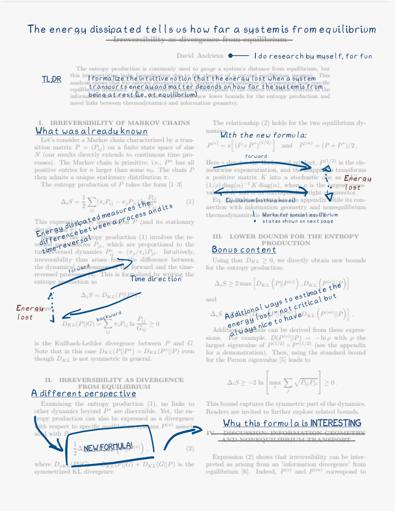

I just published a short, mathematically-oriented paper: "*Irreversibility as divergence from equilibrium*".
As usual, the paper is short and to-the-point as a way to make it [less boring](/posts/science_articles_less_boring).
However, someone not already in the field has virtually no chance of understanding what the paper is about or its implications. 

That's where the recent paper by Claire Lamman in Physics Today, [*"Translating scientific papers for the public"*](https://pubs.aip.org/physicstoday/article-abstract/77/2/52/3230045/Translating-scientific-papers-for-the-publicEager?redirectedFrom=fulltext), comes in. Lamman presents a compelling approach to make scientific papers accessible. 
In short, she overlays the original paper with clear visuals and everyday language to explain what's going on.
She is very talented as you can see directly from one of her [paper](https://cmlamman.github.io/doc/fakeRSD_spectra_summary.pdf) (plus she uses the [XKCD font](https://github.com/ipython/xkcd-font), so that is also a win).
It's super effective! 

So I decided to try it as well. 
Now, my latest paper is arguably not the best fit for this exercise: there is not a lot of space (the paper is only 3 pages long) and the concepts are highly technical. 
Nonetheless you can find a first try [here](irreversibility_accessible.pdf). 
I definitely need to improve, but it's both a fun and rewarding exercise!

<figure >

</figure>
