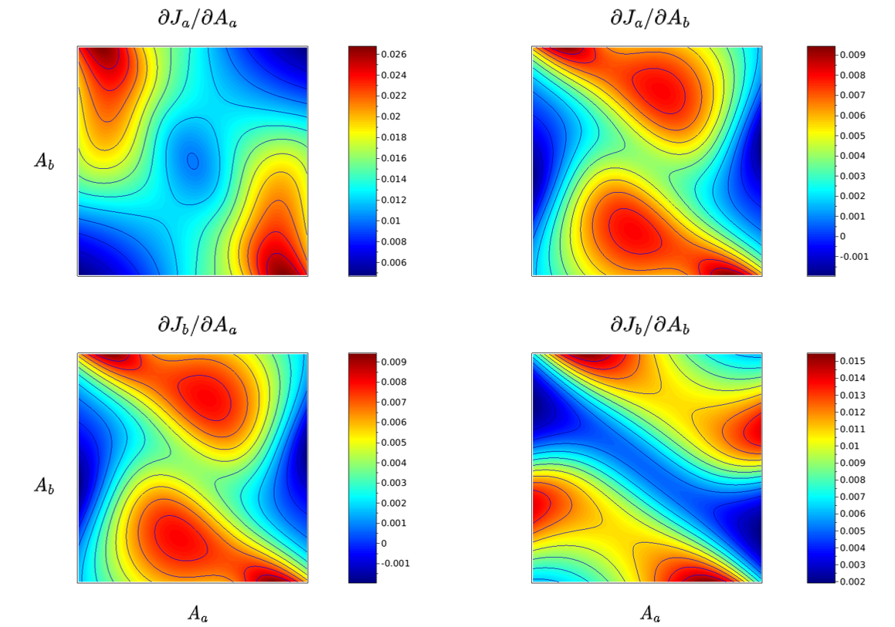

Andre Geim is famous for being both a Nobel Prize and an Ig Nobel Prize winner. 
The lesser known of the two, the Ig Nobel honors *"achievements that make people LAUGH, then THINK".*
So what is Geim's ignoble claim to fame? Levitating frogs (and other objects). 

While this obviously sounds like a fun experiment to do, why did he bother in the first place?
All started as part of Geim's "Friday afternoon" experiments, where he and his team members are encouraged to explore and play with new ideas (think of Google 20% time program - before they killed it). 

As part of his exploration, he observed - against all expectations - that he could make water float in high-intensity magnets. He quickly realized that dia-magnetism was responsible, i.e. the property of some materials to be repelled by a magnetic field. 

However, dia-magnetism is extremely weak in most objects, and it was widely assumed that it would not never be strong enough to offset gravitation. 
What's more, a classical theorem (Earnshaw's theorem) asserts that any equilibrium point resulting from a 1/r type potential would be unstable, further making levitation of non-magnetic objects a non-topic of research. 

Even so, magnetic levitation of ordinary objects was possible, and Geim had the experiment to prove it (without going more into the technical details here about Earnshaw's theorem's loopholes, Michael Berry co-received the Ig Nobel prize with Geim for his theoretical explaination of the magnetic levitation).

Yet Geim was struggling to get people interested in the dia-magnetic effect. 
His results attracted incredulity or little interest. 
After a while, he realized he had to do something different. 
That's when he did something very atypical - at least for scientists: He made the equivalent of a publicity stunt. 
In this case: levitating a frog.[^1]

  



 

*Even after seeing pictures and videos, many scientists believed this was a prank.*

 

In parallel, Geim discovered that other scientists had made the same discovery, first in the 1930s, and more recently when other researchers levitated organic matter and published their results in Nature. 
This is yet another example that scientific recognition rarely goes to the original discoverer. 

All of this to say: Even in Science, attention-grabbing effects and communication matter, *somethimes more than the idea itself.*

This brings me to a new paper I just put on arXiv: [Revealing hidden structures and symmetries of nonequilibrium transport](https://arxiv.org/abs/2401.14496).

In the paper, I apply a previously developped theory to two specific systems. 
While this does bring some new insights (e.g., in the form of analytical solutions), it is all about applying an existing theory to make it concrete. 
But the true objective of this paper is to create interest in the theory. 

<figure >

</figure>

*Notice how the top right and lower left figures are the same? That's something you would not expect, 
but that happens in every system if you know where to look.*

 

To this end, I try to present the results in a striking and compelling way.
As an example, you can see a set of colorful pictures above that - purposefully - look fairly complex. 
Yet, despite this apparent complexity, the two off-diagonal figures are strictly identical. 

This is fairly unexpected. 
As far as people knew, only the center of these pictures should be identical in a typical system (the so-called Onsager symmetry). 
Here, we see that this symmetry actually holds across the hole picture (in the paper I demonstrate how this make it happen for any system).
This is the most visual way I could imagine to illustrate that something non-trivial is happening. 

So, even tough I couldn't come up with anything as flashy as a levitating frog, I do hope this paper can serve as my "levitating frog" moment and trigger interest in the theory from the broader community.

 

[^1]: While the frog experiment is what survives in the popular account, his original paper involved his pet hamster. 
He even included it as a coauthor on one of his peer-reviewed publications under pseudonym "H.A.M.S. ter Tisha"
