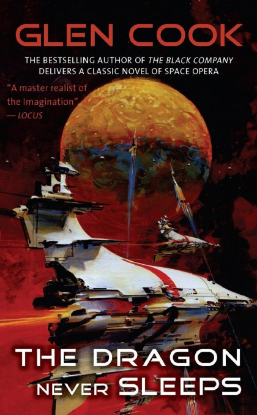

Glen Cook is a renonwed and profilic author of fantasy and science-fiction. 
His series *'The Black Company'* and *'Garrett P.I.'* are best-selling classics. 
His work also include the acclaimed *'The Dread Empire'*, *'Darkwar'* and *'Starfishers'* series.

Among this massive legacy stands as a true hidden masterpiece: *'[The Dragon Never Sleeps](https://nightshade.start-publishing.com/book/1407/the-dragon-never-sleeps/)'*. 

This space-opera is a sheer tour de force. 
It is massive in scale, hugely imaginative, and riddled with intrigue and subtelties. 
I won't give more details to avoid any spoilers - just trust that you are in for a ride.
My brain coudn't stop going back to its plot after I finished it. 

So why isn't it better known?

I suspect one the reason is the style. 
The style is concise and with very little description and hands-holding, which can leave the reader lost and confused (myself included the first time I read the book, especially as a non-native speaker). 
It's unclear tough whether this was by choice or the result of an editorial constraint - rumor has it that Glen Cook had to reduce the novel by 80,000 words for the publisher to accept the manuscript.

Paradoxically, this also makes for one of the book's strength.

This struck me this summer when I read it for the second time, in parallel with others SF books.
Forget the not-so-sublte exposition where a character decides to explain in convenient details how his world functions. Instead, Cook's worldbuilding is emerging and organic. 
And rather than lengthy descriptions and dialogues that don't add to the plot, tension, or character interactions, here every line counts. 

As a reader this means you need to pay attention, be truly present, and actively engage with the world and story. 

Yes you read more slowly and it is more exhausting to read than other SF works.
But the resulting experience left me with a deep feeling of satisfaction, just due to the fact that I was being challenged and treated with respect as a reader. 
Combined with the incredible plot and universe, this results in a true hidden gem.
