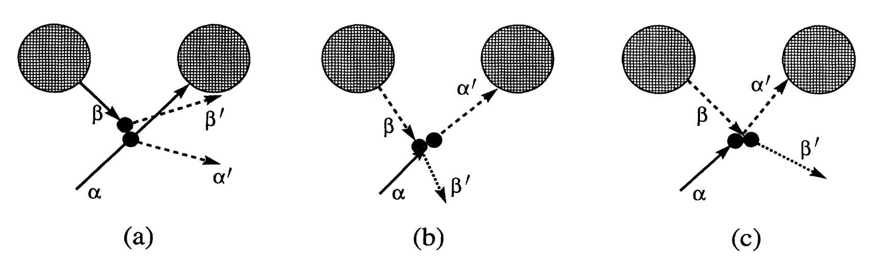
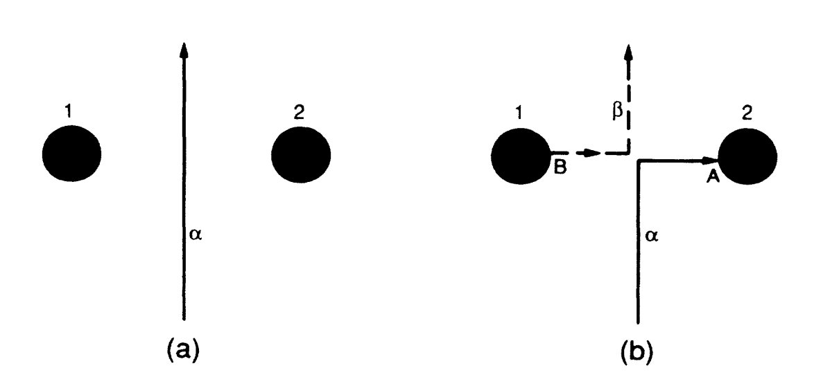

What would you do if you could travel back in time? You could be tempted to take drastic actions such as killing Hitler. You could explore your favorite era as an amateur historian. Or you could have a chat with your favorite artist, scientist or leader.

Your interferences, however innocent they appear, might lead to a time paradox. In Back to the Future, Marty McFly is sent back in time from 1985 to 1955. Soon after his arrival in 1955, Marty's mother falls in love with him, rather than with his father George McFly, threatening to cause a paradox that would result in Marty's nonexistence. How can the laws of physics accommodate such scenarios, collectively referred to as the "grandfather paradox"?

An easy (some would say cheating) way out is to consider that our universe is one amongst an infinite number of possible universes. When you travel back in time and change history you are in reality jumping to a different universe. Any inconsistency could be explained by having the paradoxical events happening in a different universe. This theory cannot, however, be tested so we will put it aside for the rest of our discussion.

General relativity allows for "closed timelike curves" (CTCs), i.e. world lines in spacetime that are returning to their starting points. Their existence seems to imply the possibility of traveling backwards in time.

The first example of closed timelike curves was discovered by Gödel in a cosmological model of a rotating universe. His solution not only showed the theoretical possibility of CTCs, but his model universe creates CTCs through every event in spacetime! Gödel was quick to point out that if we can revisit the past, then it never really “passed.” But a time that fails to pass is no time at all. With this mind-bending example, Gödel proved that Einstein's equations of spacetime are at odds with our intuitive understanding of time.

Closed word lines can also appear as parts of two connected wormholes which can thus be used as a time machine. If you enter into one end of the wormhole (and survive) you will reappear at the other end - but in the past.
This configuration can be used to model the grandfather paradox. Consider a billiard ball sent through a wormhole with such an angle that, when it comes out at the earlier end, it collides with its former self and stops it from entering the wormhole in the first place.

*Figure 1. Diagram showing a prototypical paradoxical trajectory (a) and its two self-consistent solutions with the same initial conditions (b, c). α is the original trajectory of the billiard ball, β is its later self emerging from the wormhole. α' and β' denote the trajectories after the collision (Figure taken from ref. 3)*.
 
Upon close inspection of the equations of motion, Kip Thorne and his students found a solution beginning with the original billiard ball trajectory that managed to avoid any inconsistencies (figure 1).
In this situation, the billiard ball emerges from the future and delivers its younger self a glancing blow instead of knocking it completely away from the wormhole. This blow changes its trajectory in just the right way so that it will travel back in time with the angle required to deliver its younger self this glancing blow.
Notably, they couldn't find any initial conditions for the billiard ball for which there were no self-consistent extensions. Thus it is plausible that self-consistent extensions exist for every possible initial trajectory, although this has not been proven. This observation motivates **Novikov's self-consistency principle**:
 
> *“We shall embody this viewpoint in a principle of self-consistency, which states that the only solutions to the laws of physics that can occur locally in the real Universe are those which are globally self-consistent.”* John Friedman et al.

In other words, the principle asserts that it is impossible to cause any "change" to the past that would give rise to a paradox.

Multiple self-consistent solutions arise even for non-paradoxical initial conditions. Suppose you send a billiard ball between two wormholes. An obvious solution is a collision-free, wormhole traversal-free, straight-line motion (figure 2a).
However, another possibility exists where the ball is hit as it passes between the two wormholes and gets knocked radially into the wormhole. It travels through the wormhole and returns to its impact point at just the right moment to hit itself and be deflected back onto its original trajectory (figure 2b).

*Figure 2. Two classical evolutions (histories) for a billiard ball that result from the same initial conditions (position and velocity) (figure taken from ref. 2).*
	
It is worth examining this second possibility more closely. The ball is deviated from its straight trajectory by a collision that puts it on the right path to create this same collision. Without this collision it would have continued on a straight path. So what triggered the first collision? Itself, from the future. There is no real beginning to this chain of events - in other words, it is self-generating, with intertwined/indistinguishable cause and effects.

The finding that there can be multiple - or in some cases even an infinite number of - distinct self-consistent extensions for the same initial conditions can be seen as problematic, since classically there is no way to decide which trajectory the laws of physics will choose[^1]. This difficulty is resolved in quantum mechanics, which assigns a well-defined probability to each trajectory.

These results suggest that the laws of physics might have "built-in safeguards" against time-travel paradoxes. If the self-consistency principle holds, your actions will inexorably create the exact conditions that will lead (or led?) you to perform these same actions in the first place.
This conclusion was exploited in stories and movies such as 12 Monkeys. Whether in physics or in science-fiction, it is both entertaining and fascinating to watch a self-generating chain of events unfold and untangle the interplay of its cause and effects.

**Further reading**
- I. Novikov, "Evolution of the Universe". Cambridge University Press (1983).
- J. Friedman et al., "Cauchy problem in spacetimes with closed timelike curves". Physical Review D 42, 1915 (1990).
- F. Echeverria, G. Klinkhammer and K. Thorne, "Billiard balls in wormhole spacetimes with closed timelike curves: Classical theory". Physical Review D 44, 1077 (1991).
 
[^1]: Situations where multiple solutions exist for a given initial condition also occur in classical mechanics, albeit through a different underlying mechanism. For example, a mass at rest at the apex of a dome can spontaneously move if the curvature is such that the the dynamics does not satisfy the Lipschitz conditions.
